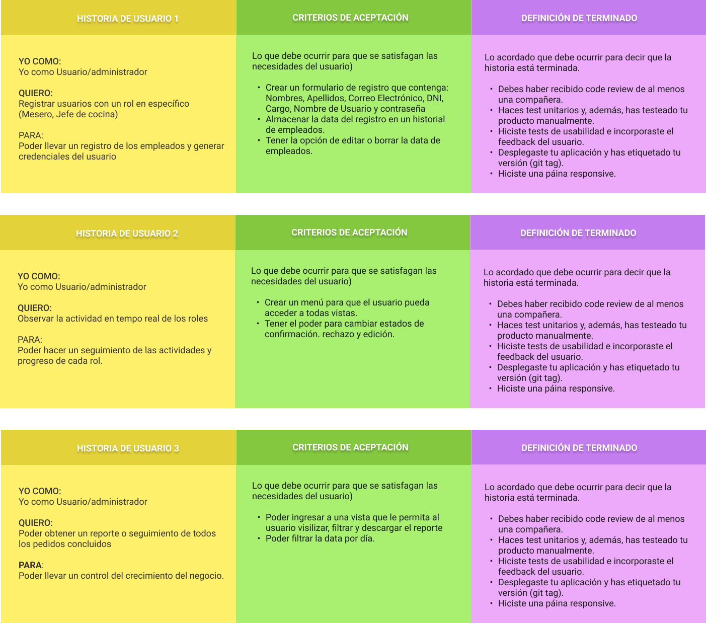
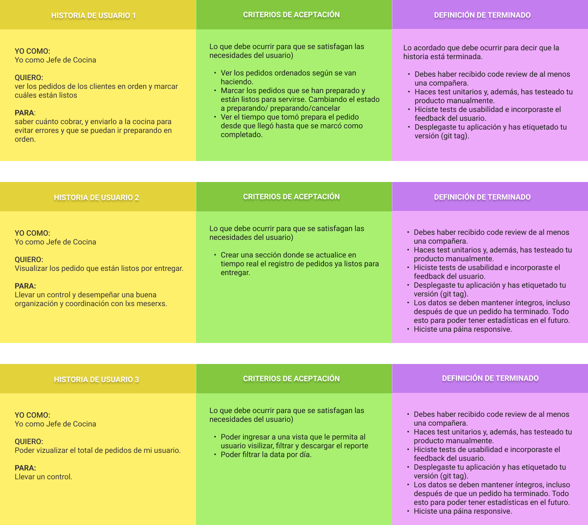
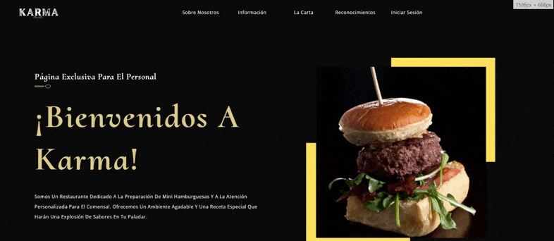
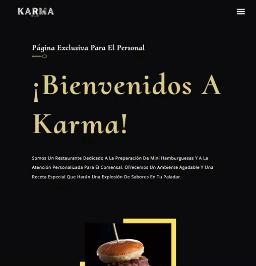
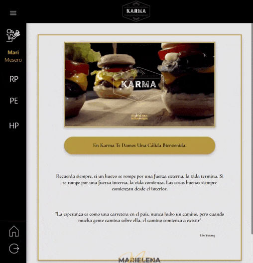
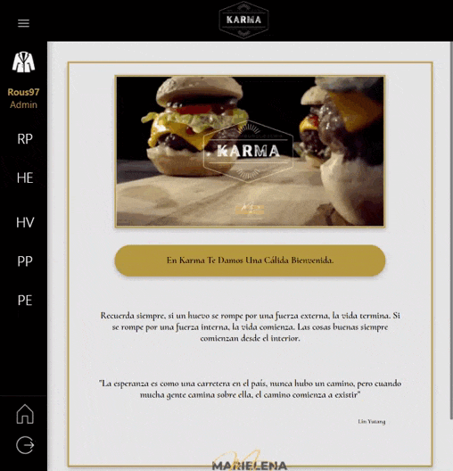
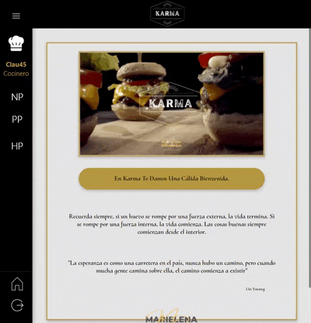
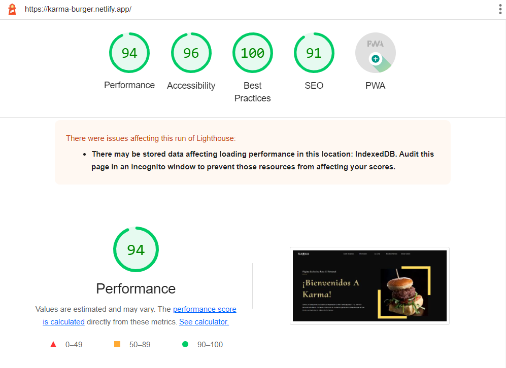
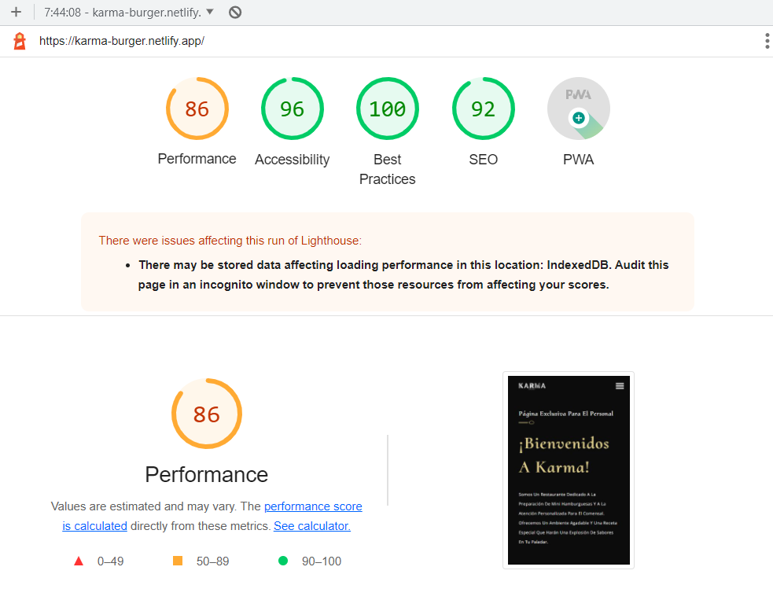

## ÍNDICE
* [1. Karma Burger](#1-Karma-Burger)
  - [1.1 Descripción del Proyecto](##1.1-Descripción-del-Proyecto)
  - [1.2 Descripción de Roles](##1.2-Descripción-de-Roles)
  - [1.3 Contenido según la vista y el rol](##1.3-Contenido-según-la-vista-y-el-rol)
  - [1.4 Interacción con la página](##1.4-Interacción-con-la-página)
* [2. Estudio de Usuario](#2-Estudio-de-Usuario)
  - [2.1 Descripción general](##2.1-Descripción-general)
  - [2.2 Flujograma de los estados para el Pedido](##2.2-Flujograma-de-los-estados-para-el-Pedido)
  - [2.3 Historia de Usuario](#2.3-Historia-de-Usuario)
* [3. Realización del Diseño](#3-Realizacion-del-Diseño)
  - [3.1 Diseño ](##3.1-Diseño)
  - [3.2 Resultado final](##3.2-Resultado-final)
* [4. Tecnologías empleadas](#4-Tecnologias-Empleadas)
* [5. Fuentes](#5-Fuentes)
* [6. Autores](#6-Autores)

***

# 1. Karma Burger

## 1.1  Descripción del Proyecto

🍔 🍟 **Karma Burger**  es una hamburguesería cuyo diferenciador es ofrecer platillos de mini hamburguesas. 🍔🍔🍔

Es una plataforma de gestión de pedidos, enfocada para los empleados con los siguientes roles: Administrador, 🤵 Mesero y 👩‍🍳Jefe de Cocina; con la finalidad de brindarles una herramienta que facilite sus actividades.

Constará con una vista inicial que ofrece información general de la empresa; y desde la cual se puede acceder a la sección de 'login', donde podrá visualizar el flujo de actividades correspondientes al rol.

## 1.2 Descripción de Roles

| ROLES | DESCRIPCIÓN | 
|--|--|
| 🤵 Administrador | Personal encargado en el flujo de actividades con los empleados | 
| 🤵 Mesero | Personal encargado en la atención directa con los comensales| 
| 👩‍🍳 Jefe de Cocina | Personal encargado en la realización gastronómica de los platillos descritos en el menú |

## 1.3  Contenido según la vista y el rol

## Vistas compartidas

| VISTA | SUB VISTAS | 
|--|--|
| Página Bienvenida | - Sobre Nosotros  - Informción - La Carta - Reconocimientos - Contáctanos |
| Inicio de Sesión | -Formulario 'Login' - Recuperación de Contraseña|

## 🤵 Administrador 

| N° | SUB VISTAS | DESCRIPCIÓN |
|--|--|--|
| 1 | Página Inicio | Contiene mensaje motivacional para el personal |
| 2 | Registrar Personal | Formulario de registro para nuevos usuarios |
| 3 | Historial de Ventas | Contiene datos básicos de la empresa y una tabla descargable en formato excel que contiene un resumen de los pedidos terminados |
| 4 | Pedidos Preparados | Muestra los pedidos concluidos por el cocinero pero que no han sido entregados al comensal |
| 5 | Pedidos Para Entregar | Muestra los pedidos listos para entregar al comensal |
| 6 | Pedidos Cancelados | Muestra los pedidos cancelados por el cocinero |

## 🤵 Mesero 

| N° | SUB VISTAS | DESCRIPCIÓN |
|--|--|--|
| 1 | Página Inicio | Contiene mensaje motivacional para el personal |
| 2 | Realizar Pedido | Vista que permite al mesero seleccionar los productos o items solicitados por el cliente, para así crear un resumen de la compra y enviarlo a cocina |
| 3 | Pedidos por Entregar | Muestra los pedidos concluidos por el cocinero pero que no han sido entregados al comensal |
| 4 | Historial de Pedidos | Contiene datos básicos de la empresa y una tabla descargable en formato excel que contiene un resumen de los pedidos terminados |

## 👩‍🍳 Jefe de Cocina 

| N° | SUB VISTAS | DESCRIPCIÓN |
|--|--|--|
| 1 | Página Inicio | Contiene mensaje motivacional para el personal |
| 2 | Nuevos Pedidos | Muestra los pedidos pendientes para peparar |
| 3 | Pedidos Preparados | Muestra los pedidos concluidos por el cocinero pero que no han sido entregados al comensal |
| 4 | Historial de Pedidos | Contiene datos básicos de la empresa y una tabla descargable en formato excel que contiene un resumen de los pedidos terminados |

## 1.4  Interación con la página
Se puede acceder a la página mediante el siguiente [link](karma-burger.netlify.app/), y además se adjunta la tabla que contiene los respectivos usuarios y contraseñas para cada rol. Con el fin de interactuar con todas las vistas y funcionalidades de la interfaz.

| ROL | USUARIO | CONTRASEÑA | 
|--|--|--|
|🤵 Administrador|rous97|123456|
|🤵 Mesero |mari|123456|
|👩‍🍳 Jefe de Cocina|clau45|123456|

***

## 2. Estudio de Usuario ✍🏼

## 2.1 Descripción general

## 🕵🏼 ¿Quienes son los principales usuarios?
Se plantearon como usuarios al Administrador, 🤵al Mesero y 👩‍🍳al Jefe de Cocina de la empresa **Karma**.

## 🕵🏼‍♀️ ¿Cuáles son los objetivos de estos usuarios en relación con el producto?

- **🤵Administrador**: Visualizar el flujo de la página en general, registro de usuarios, historiales de ventas, historial de empleados; con la finalidad de llevar una mejor gestión.

- **🤵 Mesero**:  Poder realizar los pedidos, visualizar los productos con su respectiva descripción(Nombre, precio, detalle, mesa, cliente, fecha y hora), poder enviar el pedido al jefe de cocina, visualizar los pedidos que faltan por entregar, cambiar el estado de los pedidos a entregado y visualizar el Historial de Pedidos concluidos.

- **👩‍🍳Jefe de Cocina**: Visualizar los nuevos pedidos por preparar, Poder cambiar el estado de los pedidos a preparado o cancelado y cuenta con un historial de Pedidos concluidos.

## 2.2 Flujograma de los estados para el Pedido ✍

En el siguiente diagrama podrán observar el flujo de los cambios de estado del pedido una vez creado.

## 2.3 Historia de Usuario ✍

A continuación, mostraremos algunas de las historias de Usuario según el rol:

## 📌🤵 Administrador 

## 📌🤵 Mesero

## 📌 👩‍🍳 Jefe de Cocina 

***

## 3. Realización del Proyecto

## 3.1 Diseño 📱

Para el diseño, usamos la definición de  **Atomic Design** donde divide las páginas por ***átomos***, ***moléculas*** y ***organismos**. Para ello, utilizamos la plataforma **Figma** para realizar el Wireframe y prototipado de Alta Fidelidad. 

### 3.1.1 Wireframe: 📝
En esta fase se busca realizar un esquema virtual de los componentes y las vistas.

-  [Prototipado Wireframe en Figma](https://www.figma.com/file/AFnZ0PEAFQ7KEMuY144tws/BURGER-QUEEN-R%26M?node-id=0%3A1)

### 3.1.2 Prototipado de Alta Fidelidad: 💁🏼
Teniendo como base el Wireframe, se realiza el diseño de la web considerando estilos, paleta de colores, otros recursos.

-  [Prototipado de Alta Fidelidad en Figma](https://www.figma.com/file/AFnZ0PEAFQ7KEMuY144tws/BURGER-QUEEN-R%26M?node-id=2%3A2)

A continuación, le mostraremos el proceso y algunas imágenes de referencia para la sección **"Realizar Pedido""** del rol **"mesero"**. 

***

## 3.2 Resultado final: 💁🏼
A continuación, se adjuntará una breve videodemostración del resultado final tanto en diseño como en funcionalidad. 

## 📌 Página de Bienvenida

## 📌 Inicio Sesión

## 📌🤵 Mesero

## 📌🤵 Administrador 

## 📌 👩‍🍳 Jefe de Cocina 

***

## 4. Tecnologías empleadas 👩🏾‍💻

## 4.1 Para la estructura y diseño:

-   [SASS:](https://developer.mozilla.org/es/docs/Web/CSS)  Usada para definir el estilo visual del proyecto.

-   [Jest:](https://jestjs.io/docs/es-ES/getting-started)  Framework para realizar los testing unitarios.

-   [Eslint:](https://jestjs.io/docs/es-ES/getting-started)  Herramienta de linting para analizar el código en busca de errores.

-   [React.js:](https://es.reactjs.org/) Librería implementada para crear una interfaz de usuario interactiva de manera sencilla.

-   [Javascript:](https://developer.mozilla.org/es/docs/Web/JavaScript)  Para dar la funcionalidad a la plataforma.
-   [Firebase:](https://firebase.google.com) Se trata de una plataforma móvil creada por Google, cuya principal función es desarrollar y facilitar la creación de apps de elevada calidad de una forma rápida. Para este proyecto se uso lo siguiente:
    -   [Cloud Firestore:](https://firebase.google.com/products/firestore)  Es una base de datos NoSQL orientada a los documentos. A diferencia de una base de datos SQL, no hay tablas ni filas; En su lugar, almacenas los datos en documentos, que se organizan en colecciones. Cada documento contiene un conjunto de pares clave-valor.
    -   [Cloud Storage:](https://firebase.google.com/products/storage)  Cloud Storage se diseñó para ayudarte a almacenar y procesar con rapidez y facilidad el contenido generado por usuarios, como fotos y videos.
    -   [Realtime Database:](https://firebase.google.com/products/realtime-database)  Sincronización en tiempo real para datos JSON. Firebase Realtime Database es una base de datos NoSQL alojada en la nube que te permite almacenar y sincronizar datos entre tus usuarios en tiempo real.
  

- [Netlify:](http://netlify.com) Es un servicio de hosting
para sitios web estáticos.
Para usarlo primero necesitas crear una cuenta en
Netlify y después puedes [conectar](https://www.netlify.com/blog/2016/07/22/deploy-react-apps-in-less-than-30-seconds/) tu repositorio.

- [PWA:](https://www.iebschool.com/blog/progressive-web-apps-analitica-usabilidad/) Progressive web apps (PWA) o aplicación web progresiva es una solución basada en la web tradicional que todos conocemos. La aplicación desplegada tiene más del 80% en puntuaciones de Performance, Progressive Web App, Accessibility y Best Practices de Lighthouse.

A continuación se muestran las estadísticas del performance:

## 📌 Vista Desktop

## 📌 Vista Mobile

***
## 5. Fuentes 📚
- [Repositorio de Laboratoria:](https://github.com/Laboratoria/LIM016-burger-queen) Se encuentran todas las condiciones y herramientas a trabajar para el proyecto.

***

## 6. Autores 📍
- [Marielena Aizaga](https://github.com/PandArtist93)
- [Rosamaria Rodriguez](https://github.com/RJRCH123)
- Equipo de Laboratoria LIM016

****

