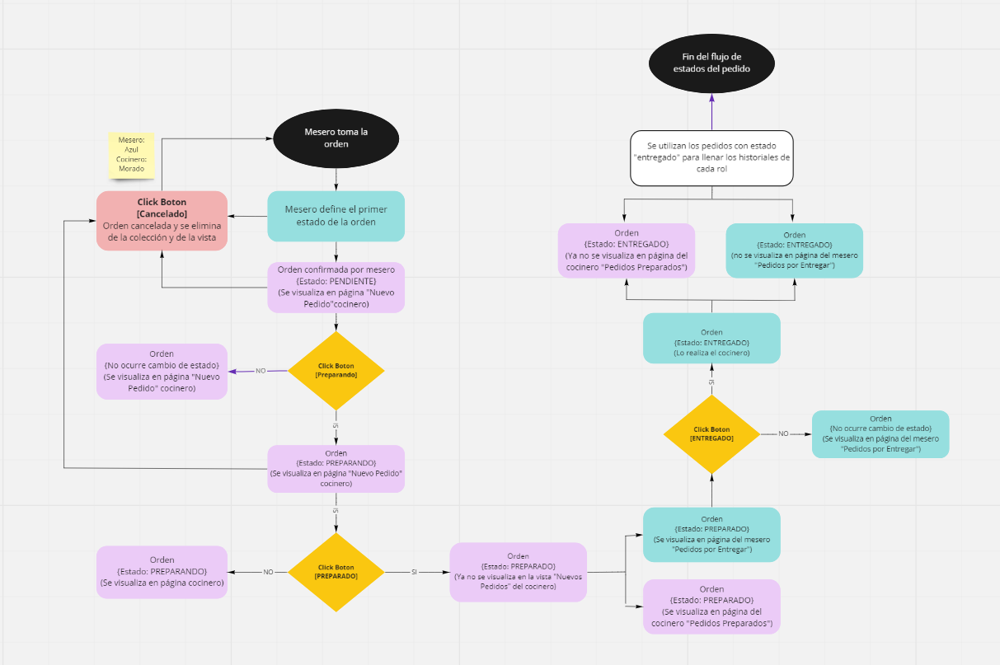
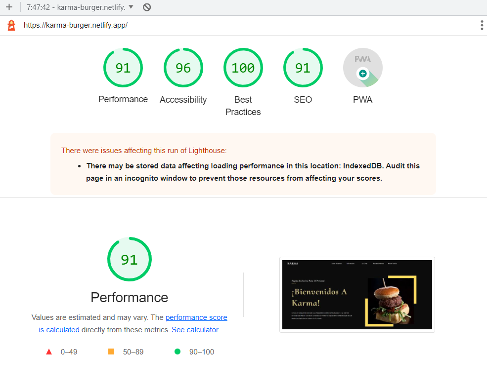

## ÍNDICE
* [1. Karma Burger](#1-Karma-Burger)
  - [1.1 Descripción del Proyecto](##1.1-Descripción-del-Proyecto)
  - [1.2 Secciones y Roles](##1.2-Secciones-y-Roles)
  - [1.3 Vistas según cada sección](##1.3-Vistas-según-cada-sección)
  - [1.4 Interacción con la página](##1.4-Interacción-con-la-página)
* [2. Estudio de Usuario](#2-Estudio-de-Usuario)
  - [2.1 Descripción general](##2.1-Descripción-general)
  - [2.2 Flujograma de los estados para el Pedido](##2.2-Flujograma-de-los-estados-para-el-Pedido)
  - [2.3 Historia de Usuario](#2.3-Historia-de-Usuario)
* [3. Realización del Diseño](#3-Realizacion-del-Diseño)
  - [3.1 Diseño ](#3.1-Diseño)
  - [3.2 Resultado final](#3.2-Resultado-final)
* [4. Tecnologías empleadas](#4-Tecnologias-Empleadas)
  - [4.1 Para la estructura y diseño](#4.1-Para-la-estructura-y-diseño)
  - [4.2 Para el Testing](#4.2-Para-el-Testing)
  - [4.3 Para la funcionalidad](#4.3-Para-la-funcionalidad)
  - [4.4 Para el Despliegue del proyecto](#4.4-Para-el-Despliegue-del-proyecto)
  - [4.5 Para la instalación de la App(PWA)](4.5-Para-la-instalación-de-la-App(PWA))
* [5. Fuentes](#5-Fuentes)
* [6. Autores](#6-Autores)

***

# 1. Karma Burger

## 1.1  Descripción del Proyecto

🍔 🍟 **Karma Burger**  es una hamburguesería cuyo diferenciador es ofrecer platillos de mini hamburguesas. 🍔🍔🍔

Es una plataforma de gestión de pedidos, enfocada para los empleados con los siguientes roles: Administrador, 🤵 Mesero y 👩‍🍳Jefe de Cocina; con la finalidad de brindarles una herramienta que facilite sus actividades.

Constará con una vista inicial que ofrece información general de la empresa; y desde la cual se puede acceder a la sección de 'login', donde podrá visualizar el flujo de actividades correspondientes al rol.

## 1.2 Descripción de Roles

| ROLES | DESCRIPCIÓN | 
|--|--|
| 🤵 Administrador | Personal encargado en el flujo de actividades con los empleados | 
| 🤵 Mesero | Personal encargado en la atención directa con los comensales| 
| 👩‍🍳 Jefe de Cocina | Personal encargado en la realización gastronómica de los platillos descritos en el menú |

## 1.3  Contenido según la vista y el rol

## Vistas compartidas

| VISTA | SUB VISTAS | 
|--|--|
| Página Bienvenida | - Sobre Nosotros  - Informción - La Carta - Reconocimientos - Contáctanos |
| Inicio de Sesión | -Formulario 'Login' - Recuperación de Contraseña|

## 🤵 Administrador 

| N° | SUB VISTAS | DESCRIPCIÓN |
|--|--|--|
| 1 | Página Inicio | Contiene mensaje motivacional para el personal |
| 2 | Registrar Personal | Formulario de registro para nuevos usuarios |
| 3 | Historial de Ventas | Contiene datos básicos de la empresa y una tabla descargable en formato excel que contiene un resumen de los pedidos terminados |
| 4 | Pedidos Preparados | Muestra los pedidos concluidos por el cocinero pero que no han sido entregados al comensal |
| 5 | Pedidos Para Entregar | Muestra los pedidos listos para entregar al comensal |
| 6 | Pedidos Cancelados | Muestra los pedidos cancelados por el cocinero |

## 🤵 Mesero 

| N° | SUB VISTAS | DESCRIPCIÓN |
|--|--|--|
| 1 | Página Inicio | Contiene mensaje motivacional para el personal |
| 2 | Realizar Pedido | |
| 3 | Pedidos por Entregar | Muestra los pedidos concluidos por el cocinero pero que no han sido entregados al comensal |
| 4 | Historial de Pedidos | Contiene datos básicos de la empresa y una tabla descargable en formato excel que contiene un resumen de los pedidos terminados |

## 👩‍🍳 Jefe de Cocina 

| N° | SUB VISTAS | DESCRIPCIÓN |
|--|--|--|
| 1 | Página Inicio | Contiene mensaje motivacional para el personal |
| 2 | Nuevos Pedidos | |
| 3 | Pedidos Preparados | Muestra los pedidos concluidos por el cocinero pero que no han sido entregados al comensal |
| 4 | Historial de Pedidos | Contiene datos básicos de la empresa y una tabla descargable en formato excel que contiene un resumen de los pedidos terminados |

## 1.4  Interación con la página
Con el fin de brindar un prototipo real de lo que sería la interacción de la página para cada rol; a continuación, se muestra el [link](karma-burguer.netlify.app/) de la página con una tabla que contiene los respectivos usuarios y contraseñas para cada rol.

| ROL | USUARIO | CONTRASEÑA | 
|--|--|--|
|🤵 Administrador|rous97|123456|
|🤵 Mesero |mari|123456|
|👩‍🍳 Jefe de Cocina|clau45|123456|

***

## 2. Estudio de Usuario ✍🏼

## 2.1 Descripción general

## 🕵🏼 ¿Quienes son los principales usuarios?
Los principales usuarios son para los empleados(Administrador, 🤵 Mesero y 👩‍🍳Jefe de Cocina) de la empresa **Karma**; cuyo fin es tener un sistema de pedidos automátizado de comunicación entre el flujo de actividades de cada rol.

## 🕵🏼‍♀️ ¿Cuáles son los objetivos de estos usuarios en relación con el producto?

- **🤵Administrador**: Tener control de la página en general, registro de usuarios, historiales de ventas, historial de empleados y flujo final de actividad según el rol.

- **🤵 Mesero**:  Poder realizar los pedidos, visualizar los productos con su respectiva descripción(Nombre, precio, detalle, mesa, cliente, fecha y hora), poder enviar el pedido al jefe de cocina, visualizar los pedidos listos para entregar, cambiar el estado de los pedidos(A entregado) y tener el Historial de Ventas

- **👩‍🍳Jefe de Cocina**: Visualizar los nuevos pedidos por preparar, Poder cambiar el estado de los pedidos(Pendiente. preparado y cancelado) y tener un historial de las ventas del día.

## 🕵🏾‍♀️ ¿Cuándo utilizan o utilizarían el producto?
Utilizarían el producto durante la jornada laboral en la empresa para realizar y llevar un registro de sus actividades.

## 2.2 Flujograma de los estados para el Pedido ✍

Para realizar las historias de Usuario, creimos conveniente empezar con el flujograma de los estados que tendrá el pedido para poder guiarnos en las necesidades para la interacción entre Mesero y Jefe de Cocina.

## 2.3 Historia de Usuario ✍

A continuación, mostraremos algunas de las historias de Usuario según el rol:

## 📌🤵 Administrador 

## 📌🤵 Mesero

## 📌 👩‍🍳 Jefe de Cocina 

***

## 3. Realización del Proyecto

## 3.1 Diseño 📱

Para el diseño, usamos le definición de  **Atomic Design** donde divide las páginas por ***átomos***, ***moléculas*** y ***organismos**. Para ello, utilizamos la plataforma **Figma** para realizar el Wireframe y prototipado de Alta Fidelidad. 

### 3.1.1 Wireframe: 📝
En esta fase se busca realizar un esquema virtual de distribución más detallado en Figma.

-  [Prototipado Tablet](https://www.figma.com/file/AFnZ0PEAFQ7KEMuY144tws/BURGER-QUEEN-R%26M?node-id=0%3A1)

### 3.1.2 Prototipado de Alta Fidelidad: 💁🏼
Luego de ya tener el Wireframe, se realiza el diseño de la web en base a estilos, paleta de colores, entre otros recursos.

-  [Prototipado Tablet](https://www.figma.com/file/AFnZ0PEAFQ7KEMuY144tws/BURGER-QUEEN-R%26M?node-id=2%3A2)

A continuación, le mostraremos el proceso y algunas imágenes de referencia para la sección **"Realizar Pedido""** del rol **"mesero"**. Si desea visualizarlo completo en el Figma puede dar click [Aquí](https://www.figma.com/file/AFnZ0PEAFQ7KEMuY144tws/BURGER-QUEEN-R%26M?node-id=0%3A1)

***

## 3.2 Resultado final: 💁🏼
A continuación se adjuntará una breve videodemostración del resultado final tanto en diseño como en funcionalidad. 

## 📌 Página de Bienvenida

## 📌 Inicio Sesión

## 📌🤵 Mesero

## 📌🤵 Administrador 

## 📌 👩‍🍳 Jefe de Cocina 

***

## 4. Tecnologías empleadas 👩🏾‍💻

## 4.1 Para la estructura y diseño:
-   [HTML:](https://developer.mozilla.org/es/docs/Web/HTML)  Siguiendo las reglas del HTML semántico se estructuró con un  `header`  que contiene una barra de navegación y el  `main`  para englobar el contenido principal.

-   [SASS:](https://developer.mozilla.org/es/docs/Web/CSS)  Usada para definir el estilo visual del proyecto.

-   [Figma:](https://www.figma.com) Plataforma para crear las estructuras del prototipo (Wireframe, prototipo de alta fidelidad, mockups).

## 4.2 Para el Testing:
-   [Jest:](https://jestjs.io/docs/es-ES/getting-started)  Framework para realizar los testing unitarios.

-   [Eslint:](https://jestjs.io/docs/es-ES/getting-started)  Herramienta de linting para analizar el código en busca de errores.
## 4.3 Para la funcionalidad:
-   [React](https://es.reactjs.org/)
-   [Javascript:](https://developer.mozilla.org/es/docs/Web/JavaScript)  Para dar la funcionalidad a la plataforma.
-   [Firebase:](https://firebase.google.com) Se trata de una plataforma móvil creada por Google, cuya principal función es desarrollar y facilitar la creación de apps de elevada calidad de una forma rápida. Para este proyecto se uso lo siguiente:
    -   [Cloud Firestore:](https://firebase.google.com/products/firestore)  Es una base de datos NoSQL orientada a los documentos. A diferencia de una base de datos SQL, no hay tablas ni filas; En su lugar, almacenas los datos en documentos, que se organizan en colecciones. Cada documento contiene un conjunto de pares clave-valor.
    -   [Cloud Storage:](https://firebase.google.com/products/storage)  Cloud Storage se diseñó para ayudarte a almacenar y procesar con rapidez y facilidad el contenido generado por usuarios, como fotos y videos.
    -   [Authentication:](https://firebase.google.com/products/auth)  Busca facilitar la creación de sistemas de autenticación seguros, a la vez que mejora la experiencia de integración y acceso para los usuarios finales. Proporciona una solución de identidad de extremo a extremo, compatible con cuentas de correo electrónico y contraseñas, autenticación telefónica, acceso mediante Google, Twitter, Facebook y GitHub, y mucho más.
    -   [Realtime Database:](https://firebase.google.com/products/realtime-database)  Sincronización en tiempo real para datos JSON. Firebase Realtime Database es una base de datos NoSQL alojada en la nube que te permite almacenar y sincronizar datos entre tus usuarios en tiempo real.

## 4.4 Para el Despliegue del proyecto:

- [Netlify:](http://netlify.com) Es un servicio de hosting
para sitios web estáticos.
Para usarlo primero necesitas crear una cuenta en
Netlify y después puedes [conectar](https://www.netlify.com/blog/2016/07/22/deploy-react-apps-in-less-than-30-seconds/) tu repositorio.

## 4.5 Para la instalación de la App(PWA):

- [PWA:](https://www.iebschool.com/blog/progressive-web-apps-analitica-usabilidad/) Progressive web apps (PWA) o aplicación web progresiva es una solución basada en la web tradicional que todos conocemos, aunque incorpora algunas particularidades que la hacen parecerse a una app nativa para teléfonos móviles y tabletas. Cada proyecto es independiente y el nivel de adaptación de la web al formato app es progresivo, por lo que puede que visitemos un site con una PWA casi idéntica a una app o quizá sea una web con algunos avances.

La aplicación desplegada debe tener 80% o más en las puntuaciones de Performance, Progressive Web App, Accessibility y Best Practices de Lighthouse.

A continuación se muestran las estadísticas del performance:

## 📌 Según Desktop

## 📌 Según Mobile

***
## 5. Fuentes 📚
- [Repositorio de Laboratoria:](https://github.com/Laboratoria/LIM016-burger-queen) Se encuentran todas las condiciones y herramientas a trabajar para el proyecto.

***

## 6. Autores 📍
- [Marielena Aizaga](https://github.com/PandArtist93)
- [Rosamaria Rodriguez](https://github.com/RJRCH123)
- Equipo de Laboratoria LIM016

****

